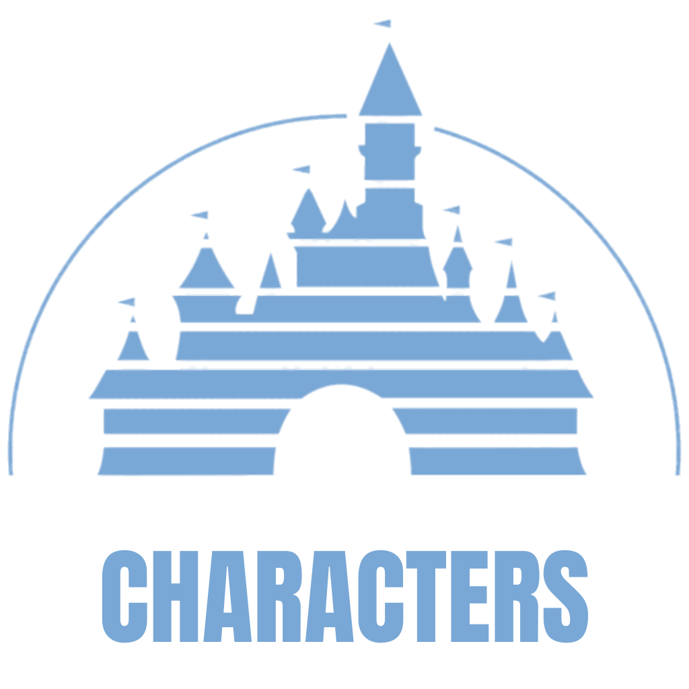

# Disney Characters



<hr>


> Um aplicativo, integrado com a API proprietária da Disney Company, focado em um showcase dos personagens pertencentes ao universo disney.

## 🎥 DEMO
[Vídeo de Demonstração](https://www.youtube.com/watch?v=SVdNMvYFlwE)

## 👩🏾‍💻 Technologies
- [x] UIKit
- [x] ViewCode
- [x] Storyboard
- [x] UITableView

## 💻 Requirements to install code

Before starting, check the following requirements:
* MacOS
* Xcode installed
* Git installed

## 🚀 Installing app code on macbook

if you have ssh configured, run the command
```
git clone git@github.com:henry-1961/Disney-Characters.git
```
if you don't have ssh configured, run the command
```
git clone https://github.com/henry-1961/Disney-Characters.git
```

After installing, open the installed folder with XCode and run `command + R`

## 📫 Contributing
1. Fork this repository
2. Create a new branch: `git checkout -b <branch_name>`.
3. Make changes and commit: `git commit -m '<commit_message>'`
4. Send to base branch: `git push origin Tegami / <local>`
5. Create a pull request.

see the GitHub documentation on [how to create a pull request](https://help.github.com/en/github/collaborating-with-issues-and-pull-requests/creating-a-pull-request)

## 🤝 By

<table>
  <tr>
    <td align="center">
      <a href="https://github.com/henry-1961">
        <br>
        <sub>
          <b>Henrique</b>
        </sub>
      </a>
    </td>
    <td align="center">
      <a href="https://github.com/AnaCecilia2">
        <br>
        <sub>
          <b>Ana Cecília</b>
        </sub>
      </a>
    </td>
  </tr>
</table>
